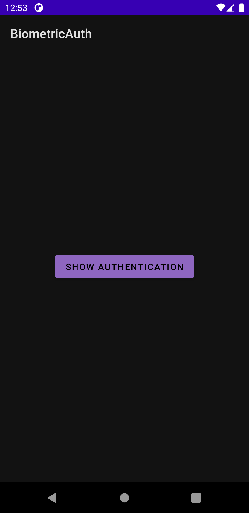
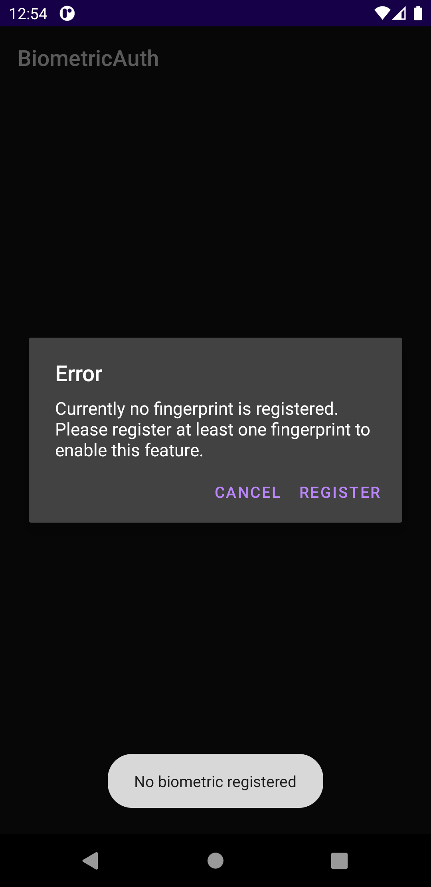
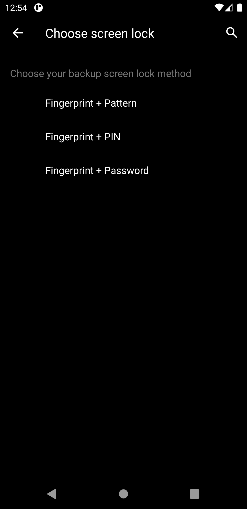
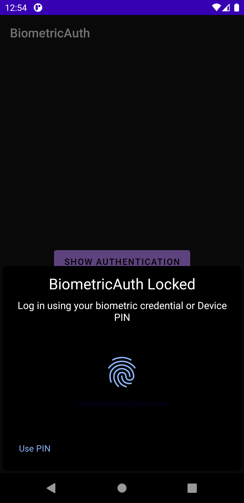
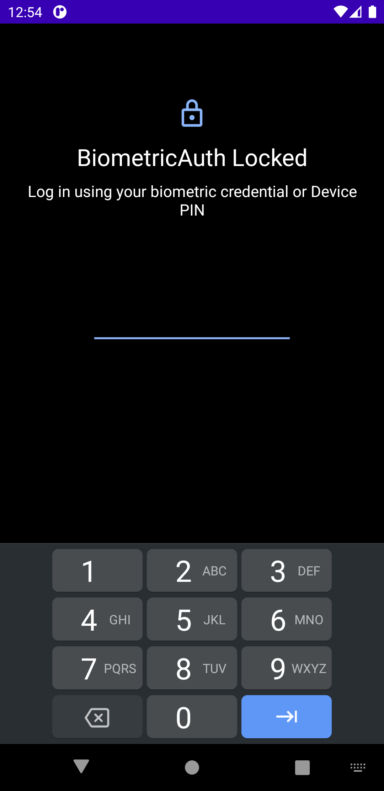

# Biometric-Auth
A sample application to display the biometric and PIN based authentication screen using BiometricPrompt.

This sample application uses `androidx.biometric:biometric:1.1.0` to display the `BiometricPrompt`. The `BiometricPrompt` will ask user for Fingerprint and an option to use Device PIN will be provided.

In case the PIN is not set or Fingerprint is not registered, then a dialog will be displayed to user to set the missing setting.

### Screenshots
        
     
